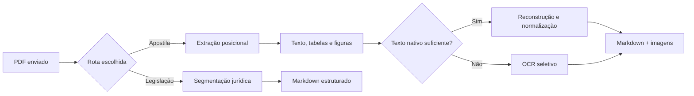

<div align="center">

# 📚 DocIntel

### Do PDF ao Markdown pronto para o Obsidian

Conversor local e privado de apostilas e documentos jurídicos.<br>
Sem API externa, sem custo por página: o processamento acontece no seu servidor.


</div>

> [!TIP]
> O DocIntel preserva a disposição visual do material sempre que possível:
> organiza texto, tabelas e figuras pelas coordenadas do PDF e cria notas
> compatíveis com o seu vault do Obsidian.

## 🧭 Navegação

- [Visão geral](#visao-geral)
- [Início rápido](#inicio-rapido)
- [Usar a interface](#usar-a-interface)
- [O que é gerado](#o-que-e-gerado)
- [Como funciona a conversão](#como-funciona-a-conversao)
- [Baixar e ajustar](#baixar-e-ajustar)
- [Markdown de Legislação](#markdown-de-legislacao)
- [Escopo e limites](#escopo-e-limites)

<a id="visao-geral"></a>
## ✨ Visão geral

| Recurso | O que oferece |
|---|---|
| 🧭 **Conversão posicional** | Texto, tabelas nativas e figuras ordenados conforme sua posição na página. |
| 🧩 **Tabelas mais legíveis** | Reconstrução das células pela geometria, preservação de listas e junção de tabelas que continuam na página seguinte. |
| 🖼️ **Fidelidade visual** | Figuras e quadros visuais são incorporados como imagens; tabelas compactas de Direito podem usar fallback visual. |
| 🔎 **OCR seletivo** | OCR de página inteira quando falta texto nativo; texto reconhecido em figuras fica recolhido em callout. |
| ⚖️ **Rotas independentes** | Apostilas e Markdown de Legislação têm filas, workers e processamento separados. |
| 🔒 **Privacidade** | Conversão local, sem envio do conteúdo a APIs externas. |

<a id="inicio-rapido"></a>
## 🚀 Início rápido

### Docker Compose

```bash
cd docintel
docker compose up -d --build
```

O container `docintel` fica disponível na porta `8097`. Abra:

```text
http://<endereço-do-seu-servidor>:8097
```

O `docker-compose.yml` cria e monta `uploads/`, `output/` e `data/` na
primeira execução. A imagem instala Python, FastAPI, Pillow e Tesseract com
os idiomas português e inglês.

<details>
<summary><strong>Executar diretamente no macOS</strong></summary>

Instale Tesseract e os dados dos idiomas português/inglês:

```bash
brew install tesseract tesseract-lang
```

Se um PDF precisar de OCR e o Tesseract não estiver disponível, o conversor
interrompe a execução com um erro explícito.

</details>

<a id="usar-a-interface"></a>
## 🖱️ Usar a interface

1. Abra a interface web e arraste um ou mais PDFs para a área de envio, ou
   clique para selecioná-los.
2. Opcionalmente, informe disciplina, professor(a), número da aula e tags.
   Esses dados são aplicados ao lote inteiro. Se o número da aula ficar vazio,
   ele é detectado pelo nome do arquivo quando possível — por exemplo,
   `Aula_05_Constitucional.pdf` → aula 5.
3. Clique em **Converter**. O processamento continua no servidor mesmo se
   você fechar a aba.
4. Quando o job terminar, baixe o Markdown pelo link da fila ou abra a pasta
   `output/` como parte do seu vault do Obsidian.

> [!NOTE]
> A interface mostra o progresso do envio em bytes. Se chegar a 100% e o job
> mudar para **processando**, o upload terminou: o servidor está convertendo
> o PDF.

<a id="o-que-e-gerado"></a>
## 📦 O que é gerado

```text
output/
└── <slug-do-arquivo>-<hash>/
    ├── <slug>.md        # Front matter YAML e conteúdo Markdown
    ├── original.pdf     # Original preservado para o ZIP
    └── images/          # Figuras extraídas e referenciadas na nota
```

### Nota pronta para o vault

O Markdown inclui front matter YAML com os metadados da nota e imagens
incorporadas pela sintaxe nativa do Obsidian (`![[nome.png]]`):

```yaml
---
disciplina: DIREITO CONSTITUCIONAL
tags:
excalidraw-plugin: parsed
data_criacao: 2026-10-08
professora: Nathalia Masson
assunto: |-
  4. Poder Legislativo
  4.6 Imunidades dos congressistas
caminho: Direito Constitucional Aula 5
---

# 4. Poder Legislativo
#### 4.6 Imunidades dos congressistas

## Poder Legislativo (continuação)
...
![[aula-05-constitucional-0001-07.png]]
```

### Organização do conteúdo

| Conteúdo do PDF | Resultado no Markdown |
|---|---|
| Sumário numerado no início | Itens reconhecidos são copiados para `assunto` no front matter e permanecem na posição original do corpo. |
| Títulos e subtítulos | Headings entre `####` e `######`, inferidos por numeração, estilo tipográfico e posição. |
| Ênfase parcial | Mantida como negrito no corpo; títulos em negrito não viram wikilinks. |
| Figuras | Incorporadas como `![[nome.png]]`; texto OCR aproximado, quando disponível, fica recolhido para consulta e busca. |
| Avisos didáticos | Blocos iniciados por “Obs.”, “Observação”, “Atenção”, “Cuidado” ou “Não se esqueça...” podem virar `> [!attention] Atenção!`. |
| Citações legais | Citações integrais reconhecidas, como `**Art. N, CF/88:**`, podem virar `> [!quote] Texto de lei`. |
| Notas de rodapé | Referências e definições são convertidas para `[^N]` e renumeradas no documento para evitar colisões entre páginas. |

O campo `assunto` é preenchido quando o início do PDF contém um bloco
reconhecível de linhas de sumário numerado — por exemplo, `4.`, `4.6`,
`5-` ou `5.1.`. Sem esse padrão, ele fica vazio em vez de tentar adivinhar.

> [!IMPORTANT]
> Avisos, citações legais, sumários e notas de rodapé são reconhecidos por
> padrões textuais e posicionais, não por compreensão do conteúdo jurídico.
> Formatos atípicos podem escapar ou ser classificados incorretamente; revise
> o Markdown antes de tratá-lo como definitivo.

<a id="como-funciona-a-conversao"></a>
## ⚙️ Como funciona a conversão



### Apostilas: texto, tabelas e figuras

- **Extração posicional:** PyMuPDF fornece texto, tabelas e imagens com
  coordenadas. Os elementos são ordenados pela posição na página, e parágrafos
  são recompostos pela geometria.
- **Figuras e quadros:** imagens rasterizadas e clusters vetoriais preenchidos
  são renderizados como figuras. A detecção vetorial considera preenchimentos
  coloridos e molduras grandes menores que a página, evitando transformar o
  desenho da página inteira numa imagem. Linhas OCR/nativas sobrepostas à
  figura não são repetidas no corpo.
- **Tiras de imagem:** tiras adjacentes de mesma largura podem ser empilhadas
  quando a distância entre bordas é de até 3 unidades da página.
- **Nomes das imagens:** páginas visuais usam
  `<nome-do-pdf>-pg<página>-fig<N>.png`; o pipeline textual legado usa
  `<nome-do-pdf>-img<N>-pg<página>.png`.
- **OCR:** páginas com menos de 30 caracteres nativos recebem OCR de página
  inteira em português e inglês, a 300 DPI. O OCR usa a mesma ordenação
  geométrica. Em páginas com texto nativo, pode ser aplicado ao recorte de uma
  figura para busca e para a opção de corte de marca d'água.
- **Texto em figuras:** o texto reconhecido é aproximado e fica em
  `> [!note]- Texto OCR (aproximado)`, sem substituir o texto principal do
  enunciado. Não é usado modelo de visão.

### Reconstrução de tabelas nativas

As tabelas usam a grade detectada pelo PyMuPDF, mas o texto das células é
reconstruído a partir das coordenadas dos caracteres — em vez de depender do
Markdown fragmentado produzido pelo extrator:

1. Recupera separações entre palavras e pontuação pela posição dos caracteres.
2. Mantém listas e quebras relevantes dentro das células com `<br>` e escapa
   `|` para não criar colunas acidentais.
3. Reúne fragmentos com a mesma grade no fim e no início de páginas
   consecutivas, preservando o cabeçalho, anexando continuações à célula
   correspondente e removendo colunas totalmente vazias.
4. No perfil **Direito**, tabelas compactas com até 3 linhas e 4 ou mais
   colunas podem ser preservadas como imagem, acompanhadas pelo texto extraído
   no callout recolhido `> [!note]- Texto da tabela`.

Os limites de geometria e os critérios de fallback são configuráveis no início
de [`app/tabelas.py`](app/tabelas.py). Tabelas simples de **Lógica** continuam
como tabelas Markdown.

### Normalização e proteção do texto

- **Símbolos lógicos:** variantes ASCII/OCR são normalizadas para Unicode
  somente em contexto de fórmula: `P v Q` → `P ∨ Q`, `P > Q` → `P ⇒ Q` e
  `P = Q` → `P ⇔ Q`. Letras como `v` e `A` na prosa permanecem inalteradas.
- **Rodapés:** a faixa inferior de 7% da página é ignorada; URLs e domínios
  reconhecidos são removidos mesmo com espaços ou erros comuns de OCR.
  Links legítimos no corpo são preservados.
- **Legislação isolada:** `pymupdf4llm.use_layout(False)` permanece ativo para
  a rota de legislação, evitando que seu classificador ONNX substitua o texto
  nativo. As melhorias geométricas de tabelas são exclusivas da rota de
  apostilas e não modificam a conversão de legislação.

## 🧵 Fila, isolamento e recuperação

| Comportamento | Como funciona |
|---|---|
| ⚡ Processamento em segundo plano | Uma fila de workers processa os uploads; o padrão é 2 workers e pode ser ajustado com `DOCINTEL_WORKERS`. |
| 🛡️ Isolamento por processo | Cada conversão roda em processo separado; um PDF corrompido não derruba os outros jobs. |
| ⏹️ Cancelamento real | Cancelar encerra o processo de conversão, inclusive durante OCR demorado. |
| 🔁 Deduplicação | Um PDF já convertido é identificado por hash e a saída é reaproveitada sem reprocessamento. |
| ♻️ Recuperação | Jobs pendentes voltam à fila após a reinicialização do container. |
| 🗃️ Persistência | Fila e histórico são armazenados em `data/docintel.db` (SQLite). |

A interface apresenta os estados **pendente → processando → concluído/erro/
cancelado**, o tempo decorrido e a mensagem de erro quando um job falha.

<a id="baixar-e-ajustar"></a>
## ⬇️ Baixar e ajustar

### Baixar os resultados

Cada job concluído pode ser baixado como ZIP com o Markdown, as imagens e o
PDF original. O seletor oferece três níveis de compressão do PDF:
**Menor**, **Média** (padrão) e **Maior**.

No Chrome e no Edge, o download abre o diálogo nativo “salvar como”. Em outros
navegadores, vale o comportamento de download configurado pelo próprio
navegador; sites não podem forçar esse diálogo em todos eles.

### Ajustes disponíveis

| Opção | Descrição |
|---|---|
| `DOCINTEL_WORKERS` | Número de conversões em paralelo, definido no `docker-compose.yml`. Como OCR pode usar um core inteiro por página em picos, comece em 2 e aumente observando o uso de CPU. |
| `--crop-watermark` | Recorte opcional de marca d'água, desligado por padrão. A interface web não o ativa. |
| Lote de arquivos | É possível selecionar vários PDFs ou arrastar uma pasta; a fila processa o lote sem bloquear a interface. |

Para ativar o recorte numa execução manual do worker:

```bash
python worker_convert.py \
  <pdf> <diretorio-de-saida> <meta.json> <resultado.json> \
  --crop-watermark
```

<a id="markdown-de-legislacao"></a>
## ⚖️ Markdown de Legislação

> [!NOTE]
> Esta é uma rota aditiva e isolada: converte leis e códigos sem alterar o
> pipeline padrão de apostilas.

O botão **Markdown de Legislação**, ao lado de **Converter**, usa os mesmos
arquivos selecionados, mas envia o lote a `/api/convert-legislacao` em vez de
`/api/convert`. Sua fila (`legislacao_jobs`), banco e worker
(`worker_convert_legislacao.py`) são separados, com subprocessos isolados,
cancelamento real e recuperação após reinício.

A rota reorganiza o texto como
`Art. → caput → incisos → alíneas → parágrafos`, usando sinais de pontuação
como marcadores estruturais. Não tenta reconstruir espaçamentos de palavras
fora dessas quebras. Reutiliza funções de extração segura do `converter.py`
sem modificá-las: OCR manual somente em páginas sem texto nativo, reflow de
parágrafos e remoção de rodapé.

### Regras de segmentação

| Elemento | Regra |
|---|---|
| **Caput** | Termina no primeiro `:`. |
| **Inciso** | Numeral romano seguido de travessão (`I –`); `;` delimita os incisos. |
| **Alínea** | Marcadores `a)`, `b)` etc.; aceita também o formato itálico `_a)_`. |
| **Parágrafo** | `§ N º` só é estrutural logo após `.` ou `;`; assim, remissões como “nos termos do art. 5º, § 2º” não iniciam um parágrafo novo. |
| **Parágrafo único** | Segue a mesma regra posicional e precisa ocorrer após `.` ou `;`. |

A conversão também remove quebras de página no meio de um artigo e cabeçalhos
correntes repetidos (por exemplo, `152 Código Civil`). Não extrai imagens:
essa rota prioriza a estrutura textual. Foi testada com compilações do Vade
Mecum do Senado Federal, incluindo Constituição, Código Civil e Código Penal.
Os detalhes da heurística ficam em `converter_legislacao.py`.

<a id="escopo-e-limites"></a>
## 🎯 Escopo e limites

O DocIntel se concentra em **PDF → Markdown para Obsidian**. Não inclui RAG,
geração de flashcards ou Docling; se esses recursos forem necessários, a
recomendação é implementá-los como serviços separados que consumam o Markdown
já limpo.

Também ficam de fora, de propósito:

- `==destaques==` automáticos no corpo do texto;
- `#tags` inline automáticas;
- wikilinks conceituais inferidos a partir da doutrina.

Esses recursos exigem decidir o que é conceitualmente importante, não apenas
reconhecer posição ou pontuação. Uma heurística pode atribuir destaques ou
links incorretos; é preferível deixar essa decisão para revisão manual.

---

<div align="center">

**Feito para transformar material de estudo em notas úteis — sem esconder o PDF original.**

</div>
